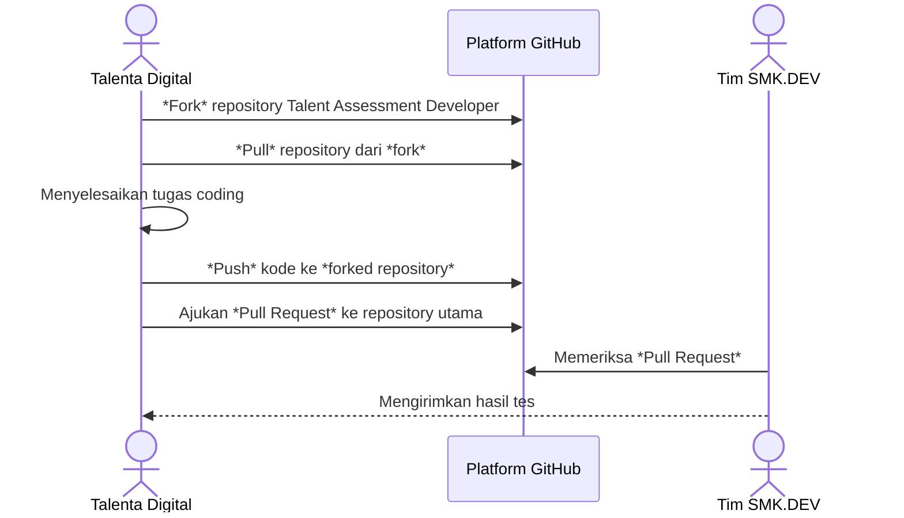

# SMK.DEV Siap Menghasilkan Talenta Digital Siap Kerja

SMK.DEV merupakan lembaga pelatihan yang berkomitmen mencetak talenta digital bertaraf global. Program kami dirancang untuk memberikan pembelajaran mendalam yang relevan, berbasis *project-based learning*, serta dibimbing langsung oleh para profesional industri. Dengan pendekatan ini, peserta akan memiliki keterampilan praktis yang siap diaplikasikan di dunia digital yang terus berkembang.


## Tahapan Tes Coding

Sebagai bagian dari proses seleksi, peserta akan mengikuti beberapa tahapan tes yang dirancang untuk memastikan kesiapan, kemampuan teknis, serta kecocokan terhadap kebutuhan industri. 


### Tahapan Test:
1. **Proses Seleksi:**
   Anda akan mengikuti serangkaian tes untuk mengukur kemampuan dan kesiapan Anda sebelum disalurkan sebagai talenta digital.

2. **Tes Coding sebagai Tahap Utama:**
   Tes coding merupakan salah satu tahapan seleksi utama. Tes ini bertujuan untuk mengevaluasi kemampuan teknis Anda secara komprehensif, mulai dari pemahaman algoritma, logika pemrograman, hingga kualitas penulisan kode.

3. **Tujuan Tes Coding:**
   Tes ini dirancang untuk memvalidasi keahlian Anda agar sesuai dengan kebutuhan spesifik klien yang akan Anda hadapi.

4. **Pengumuman Hasil:**
   Hasil tes coding akan diumumkan dalam waktu maksimal 1x24 jam setelah penyelesaian tes.


## Alur Tes Coding

Berikut adalah alur pelaksanaan tes coding yang perlu Anda ikuti:  




## **Instruksi Tes Coding**

Ikuti langkah-langkah berikut untuk menyelesaikan tes coding dengan benar:

1. **Ambil Repository dari Fork:**
   Lakukan *fork* pada repository tes di [Talent Assessment Developer](https://github.com/smkdev-id/talent-assesment-developer) dan lakukan *pull* ke lokal Anda.

2. **Selesaikan Tugas pada Fungsi yang Telah Disediakan:**
   Tulis kode di dalam fungsi yang sudah ditentukan. Contoh format fungsi:
   ```javascript
   function WeightedStrings(keyword, query) {
       // Tulis kode di sini
   }
   ```

3. **Lakukan Commit Sesuai Standar:**
   Gunakan format *commit* yang sesuai dengan standar [Conventional Commit](https://www.conventionalcommits.org/en/v1.0.0/).

4. **Jalankan Unit Testing:**
   Uji kode Anda menggunakan metode **unit testing** untuk memastikan fungsionalitasnya sesuai.

5. **Push dan Ajukan Pull Request:**
   Lakukan *push* kode ke repository yang telah di-*fork*, kemudian ajukan *pull request* ke repository utama.

6. **Ajukan Pertanyaan jika Diperlukan:**
   Jika terdapat pertanyaan atau kendala, silakan ajukan melalui fitur *issue* di [repository GitHub](https://github.com/smkdev-id/talent-assesment-developer).


Dengan mengikuti tahapan dan panduan ini, kami yakin Anda dapat menunjukkan kemampuan terbaik Anda sebagai talenta digital masa depan. 

**Selamat Mengerjakan!**


## Ikuti Kami di Media Sosial

- [WebSite](https://www.smk.dev/)
- [Instagram](https://www.instagram.com/smkdev.official/)
- [LinkedIn](https://www.linkedin.com/in/username)
- [YouTube](https://www.youtube.com/@smkdev)
- [GitHub](https://github.com/smkdev-id)
  
